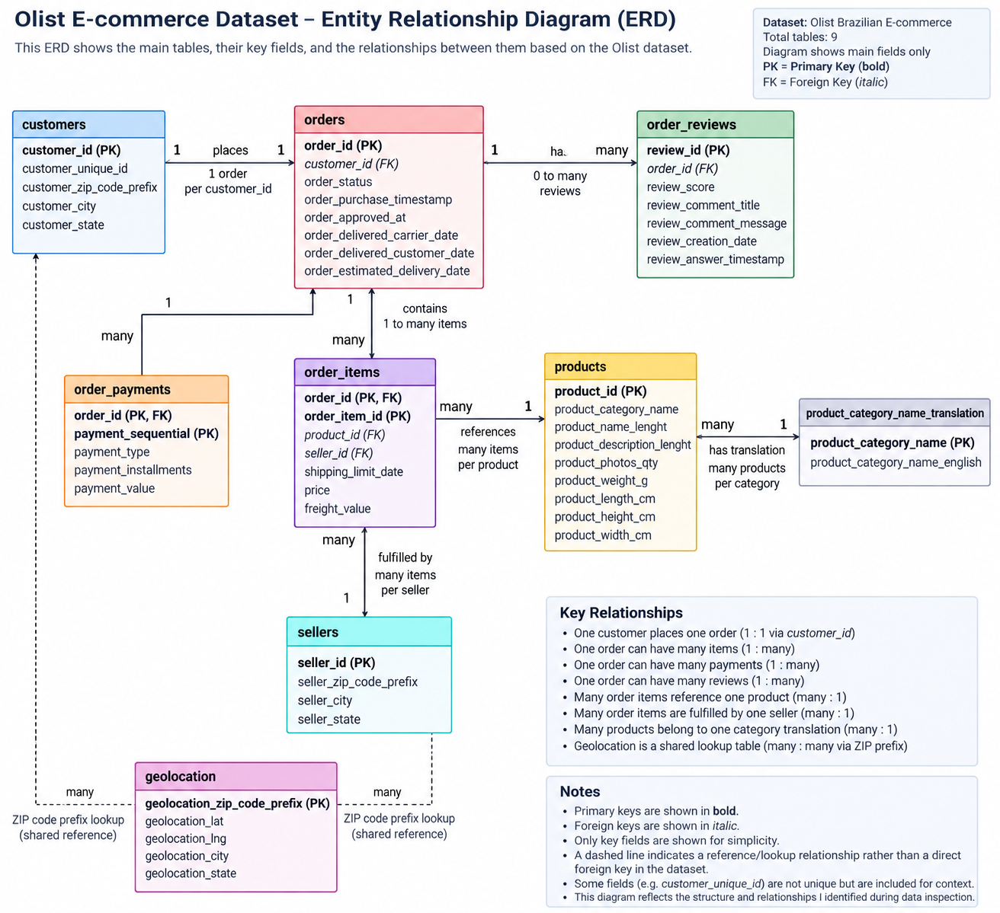

# Olist Data Quality Pipeline

An end-to-end data quality pipeline for nine related Olist e-commerce datasets, covering raw data inspection, quality assessment, defensible cleaning, validation, and SQLite database creation.

The project focuses on a practical question: what should actually be changed in messy data, and what should be preserved because the correct value cannot be justified?

## Key Results

| Metric | Result |
|---|---:|
| Related source tables | 9 |
| Orders | 99,441 |
| Order items | 112,650 |
| Exact geolocation duplicates removed | 261,831 |
| Cleaned geolocation rows | 738,332 |
| Product records | 32,951 |
| SQLite tables created | 9 |

## Dataset

I used the Brazilian E-Commerce Public Dataset by Olist, covering approximately 100,000 orders from 2016–2018 across nine related datasets.

Source: [Kaggle - Brazilian E-Commerce Public Dataset by Olist](https://www.kaggle.com/datasets/olistbr/brazilian-ecommerce)

## Data Model

The dataset is relational rather than a collection of independent CSV files. The ER diagram below shows the main relationships between the nine tables.



## Tools

- Python
- pandas
- SQLite
- Jupyter Notebook
- Git / GitHub

## Project Workflow

### 1. Raw Data Inspection

[Open notebook](https://github.com/ReinSoup/OLIST-Data-Quality-Pipeline/blob/main/notebooks/01_Raw_Data_Inspection.ipynb)

I inspected all nine source tables before modifying the data, including dimensions, data types, missing values, duplicates, identifier uniqueness, relationships, and suspicious values.

Key findings included 261,831 exact duplicate geolocation rows, 8 delivered orders missing customer delivery dates, repeated review IDs that were not safe to remove automatically, 610 products missing category information, and several geographic inconsistencies that required caution rather than blind correction.

### 2. Data Quality Assessment

[Open notebook](https://github.com/ReinSoup/OLIST-Data-Quality-Pipeline/blob/main/notebooks/02_Data_Quality_Assessment.ipynb)

I converted the inspection findings into explicit decisions before cleaning.

The main rule was:

> An unusual value is not automatically a bad value.

I classified findings as clear errors, legitimate structural characteristics, ambiguous values worth preserving, or anomalies that could not be corrected safely without an authoritative source.

### 3. Data Cleaning

[Open notebook](https://github.com/ReinSoup/OLIST-Data-Quality-Pipeline/blob/main/notebooks/03_Data_Cleaning.ipynb)

The cleaning stage applied only the decisions supported by the assessment.

| Issue | Action |
|---|---|
| Exact duplicate geolocation rows | Removed |
| Order timestamp strings | Converted to datetime |
| Review timestamp strings | Converted to datetime |
| Misspelled product columns | Renamed |
| Delivered orders missing delivery dates | Preserved |
| Repeated review IDs | Preserved |
| Zero-installment credit-card records | Preserved |
| Missing product categories | Preserved |
| Missing product dimensions | Preserved |
| Geographic inconsistencies | Preserved |
| Untranslated categories | Preserved |

The cleaned datasets were exported to `data/cleaned/` with `index=False`, while the raw source data remained separate.

### 4. Data Validation

[Open notebook](https://github.com/ReinSoup/OLIST-Data-Quality-Pipeline/blob/main/notebooks/04_Validation.ipynb)

I reloaded the cleaned CSV files and independently checked that the intended transformations had occurred without destroying information that was deliberately preserved.

Validation confirmed:

- Exact geolocation duplicates were removed.
- The cleaned geolocation table contains 738,332 rows.
- Corrected product column names are present.
- Expected missing values and ambiguous records remain.
- `orders.order_id`, `products.product_id`, and `sellers.seller_id` remain unique.
- `order_items` contains no duplicate `order_id + order_item_id` combinations.
- Repeated review IDs were preserved.

A key validation lesson was that CSV files do not preserve pandas dtypes, so datetime columns must be parsed again after reloading.

### 5. SQLite Database

[Open notebook](https://github.com/ReinSoup/OLIST-Data-Quality-Pipeline/blob/main/notebooks/05_Database_Creation.ipynb)

I created `data/database/olist.db` from the cleaned datasets using Python's `sqlite3` module and pandas.

The database contains nine tables:

| Table | Rows | Columns |
|---|---:|---:|
| `customers` | 99,441 | 5 |
| `geolocation` | 738,332 | 5 |
| `orders` | 99,441 | 8 |
| `order_items` | 112,650 | 7 |
| `order_payments` | 103,886 | 5 |
| `order_reviews` | 99,224 | 7 |
| `products` | 32,951 | 9 |
| `sellers` | 3,095 | 4 |
| `product_category_name_translation` | 71 | 2 |

I validated table schemas with `PRAGMA table_info()`, checked row counts with `COUNT(*)`, and verified that the cleaned data relationships were preserved.

## Key Data Quality Findings

### Geolocation duplication

261,831 exact duplicate rows were removed from the geolocation table, reducing it from 1,000,163 rows to 738,332.

I removed only exact duplicates. Repeated ZIP prefixes were preserved because multiple geographic records for a ZIP prefix are part of the source structure.

### Missing delivery dates

8 orders were marked as `delivered` but had no customer delivery date.

I preserved them because the correct dates could not be reconstructed reliably.

### Repeated review IDs

789 `review_id` values appeared more than once across 1,603 rows.

I preserved them because the repeated IDs were associated with different orders, and removing rows by `review_id` alone could discard valid relationships.

### Missing product information

610 products were missing category and several descriptive fields.

2 products were missing all four physical measurements.

I preserved these missing values rather than inventing information.

### Geographic inconsistencies

Potential ZIP, city, state, and coordinate inconsistencies were identified in customer, seller, and geolocation data.

I treated these as anomalies requiring authoritative verification rather than making unsupported corrections.

## Relational Data Understanding

The project also involved distinguishing genuine relational repetition from accidental duplication.

An order can legitimately have multiple:

- `order_items`
- `order_payments`
- `order_reviews`

Therefore, repeated `order_id` values in child tables are not automatically duplicates.

For `order_items`, the meaningful identifier is the composite key:

```text
order_id + order_item_id
```

This reasoning was important when validating the data and deciding which duplicate checks were appropriate.

## Repository Structure

```text
OLIST-Data-Quality-Pipeline/
│
├── data/
│   ├── raw/
│   ├── cleaned/
│   └── database/
│
├── notebooks/
│   ├── 01_Raw_Data_Inspection.ipynb
│   ├── 02_Data_Quality_Assessment.ipynb
│   ├── 03_Data_Cleaning.ipynb
│   ├── 04_Validation.ipynb
│   └── 05_Database_Creation.ipynb
│
├── OLIST_ER_Diagram.png
├── .gitignore
├── LICENSE
├── requirements.txt
└── README.md
```

## How to Reproduce

1. Download the Olist dataset from Kaggle.
2. Place the raw CSV files in `data/raw/`.
3. Install the project dependencies.
4. Run the notebooks in order from `01` through `05`.
5. Review the cleaned CSV outputs in `data/cleaned/` and the SQLite database in `data/database/`.

The notebooks contain the inspection, reasoning, cleaning code, validation checks, and database creation steps.

## Technical Skills Demonstrated

- pandas DataFrame inspection and filtering
- Missing-value and duplicate analysis
- Identifier uniqueness checks
- Cross-table relationship validation
- `.merge()`, `.groupby()`, `.isin()`, and boolean filtering
- `.drop_duplicates()` and `.rename()`
- Datetime conversion with `pd.to_datetime()`
- CSV export with `.to_csv()`
- SQLite database creation with `sqlite3`
- DataFrame loading with `.to_sql()`
- SQL querying with `pd.read_sql()`
- Schema inspection with `PRAGMA table_info()`
- Validation with SQL `COUNT(*)`
- Reasoning about one-to-many relationships and composite keys

I kept the implementation straightforward and readable rather than adding unnecessary abstraction.

## Project Status

| Stage | Status |
|---|---|
| Raw data inspection | Complete |
| Data quality assessment | Complete |
| Data cleaning | Complete |
| Cleaned data export | Complete |
| Data validation | Complete |
| SQLite database creation | Complete |
| SQLite validation | Complete |

The current scope ends at validated cleaned datasets and a validated SQLite database. Downstream analytics, dashboards, and machine-learning modeling are outside the scope of this project.

## Final Outcome

I started with nine related raw Olist CSV files and built a documented workflow that:

1. Inspected the source data.
2. Measured and assessed data-quality issues.
3. Applied only defensible cleaning operations.
4. Preserved ambiguous information instead of inventing corrections.
5. Exported cleaned datasets.
6. Independently validated the cleaned outputs.
7. Built a SQLite database from the cleaned data.
8. Validated the database structure and contents.

The result is a reproducible data-quality workflow from raw e-commerce data to validated cleaned datasets and a queryable SQLite database.
